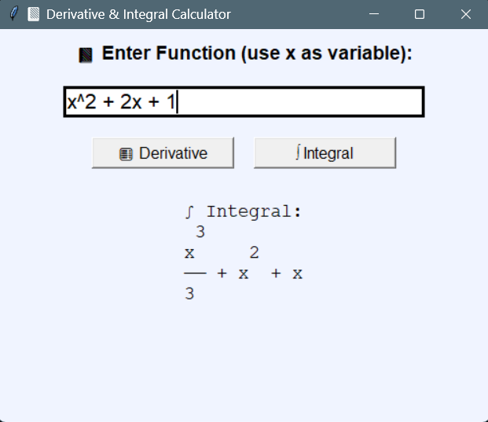
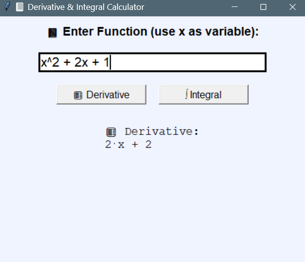

# Derivative & Integral Calculator

A simple and clean Python GUI app to calculate **derivatives** and **integrals** of expressions like `x^2 + 2x + 1`, `sin(x)`, etc.

## Features

- Accepts user input with `x` as variable
- Supports `^` for powers (auto converted to `**`)
- Calculates:
  - ✅ Derivative
  - ✅ Indefinite Integral
- GUI using `tkinter`
- Math engine: `sympy`

## 🖼️ Screenshot




## 📦 Requirements

```bash
pip install sympy
